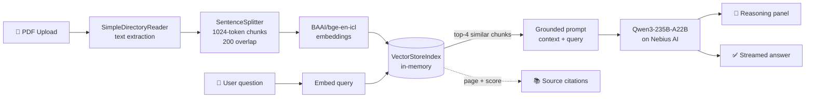

<div align="center">

# 🤖 Qwen3 RAG Chat

### Stop scrolling through PDFs. Start asking them questions.

A production-ready **Retrieval-Augmented Generation** chat app that turns any PDF into a conversation — powered by **Qwen3-235B-A22B**, one of the most capable open-weight models ever released, served blazing fast on **Nebius AI**.

### [▶ Try the live demo](https://qwen3-pdf-rag-chat.streamlit.app)

[](https://qwen3-pdf-rag-chat.streamlit.app)

[](https://www.python.org/)
[](https://streamlit.io/)
[](https://www.llamaindex.ai/)
[](https://dub.sh/nebius)
[](LICENSE)

</div>

---

## 💡 Why this exists

> **Note on the live demo:** it runs on bring-your-own-key. Paste your own [free Nebius API key](https://dub.sh/nebius) into the sidebar — it stays in your browser session and is never stored server-side.

You have a 90-page research paper, a dense contract, or an annual report. You need one specific number, clause, or claim — and `Ctrl+F` isn't going to find it, because you don't know the exact wording.

**Qwen3 RAG Chat** solves that. Drop the PDF in, ask in plain English, and get an answer that is *grounded in the actual text of your document* — with the retrieved passages shown right alongside, so you can verify every claim instead of trusting a black box.

No fine-tuning. No vector database to provision. No data leaving your session. Just upload and ask.

---

## ✨ Features

| | Feature | What it does for you |
|---|---|---|
| 📄 | **PDF Upload & Live Preview** | Drop in a PDF and read it in the sidebar while you chat — no tab-switching |
| 💬 | **Streaming Chat Interface** | Answers stream in token-by-token, so you never stare at a spinner |
| 🧠 | **Transparent AI Reasoning** | Qwen3 is a *hybrid reasoning* model. Its internal `<think>` monologue is captured and tucked into a collapsible panel — peek at *how* it reached the answer |
| 📚 | **Cited Source Passages** | Every response ships with the exact chunks it retrieved, complete with page numbers and similarity scores |
| 🎯 | **State-of-the-Art Embeddings** | `BAAI/bge-en-icl` — an in-context-learning embedding model that tops the MTEB retrieval leaderboards |
| 🔄 | **Smart Re-index Caching** | Documents are fingerprinted by SHA-256. Re-run the app and your PDF is *not* re-embedded — saving you time and tokens |
| 🔀 | **Swap Models Instantly** | Toggle between **Qwen3-235B-A22B** and **DeepSeek-V3** from the sidebar |
| 🔐 | **Bring-Your-Own-Key** | Your API key lives in your browser session, never on a server, never in a log |

---

## 🖼️ How it looks

```
┌──────────────────────────┬──────────────────────────────────────────────┐
│  ⚙️  SETUP               │  🤖 Qwen3 RAG Chat                           │
│  ┌────────────────────┐  │  Retrieval-augmented chat over your PDFs     │
│  │ Nebius API key ••• │  │                                              │
│  └────────────────────┘  │  👤 What were the total revenues in FY24?    │
│  Model: Qwen3-235B-A22B  │                                              │
│                          │  🤖 ▸ 💭 Model reasoning                     │
│  📄 DOCUMENT             │     Total revenues for fiscal 2024 were      │
│  ┌────────────────────┐  │     $4.13 billion, up 18% year over year.    │
│  │                    │  │                                              │
│  │   [ PDF preview ]  │  │     ▸ 📚 Retrieved sources                   │
│  │                    │  │       1. Page 42 — score 0.891               │
│  └────────────────────┘  │       2. Page 43 — score 0.847               │
│  🗑️ Clear chat history   │                                              │
└──────────────────────────┴──────────────────────────────────────────────┘
```

---

## 🏗️ Architecture



### The RAG pipeline, step by step

1. **Ingest** — `SimpleDirectoryReader` extracts text and page metadata from your PDF.
2. **Chunk** — `SentenceSplitter` breaks it into 1024-token windows with 200 tokens of overlap, so no sentence is orphaned across a boundary.
3. **Embed** — each chunk becomes a dense vector via `BAAI/bge-en-icl`.
4. **Index** — vectors land in an in-memory `VectorStoreIndex`, cached on the file's SHA-256 digest.
5. **Retrieve** — your question is embedded and matched against the index; the top 4 chunks win.
6. **Generate** — those chunks are injected into a strict, anti-hallucination prompt and handed to Qwen3, which streams its answer back.

> The system prompt explicitly instructs the model to answer **only** from the retrieved context and to say so plainly when the document doesn't contain the answer — the single most effective guard against confident nonsense.

### Tech stack

| Layer | Choice | Why |
|---|---|---|
| **UI** | Streamlit | Chat primitives, file upload, and streaming out of the box |
| **Orchestration** | LlamaIndex | Best-in-class RAG plumbing: readers, splitters, retrievers, synthesizers |
| **Generation** | Qwen3-235B-A22B (MoE, 22B active) | Frontier-grade reasoning at a fraction of the compute |
| **Embeddings** | BAAI/bge-en-icl | Top-tier retrieval quality on MTEB |
| **Inference** | Nebius AI | Fast, affordable, OpenAI-compatible hosting |
| **PDF** | PyPDF2 / pypdf | Reliable text + page-label extraction |

---

## 🚀 Quick start

### Prerequisites

- **Python 3.10+**
- A **[Nebius AI API key](https://dub.sh/nebius)** (free tier available)

### 1. Clone

```bash
git clone https://github.com/tirth1263/Qwen3-PDF-RAG-Chat.git
cd Qwen3-PDF-RAG-Chat
```

### 2. Install

```bash
# Using pip
python -m venv .venv
source .venv/bin/activate      # Windows: .venv\Scripts\activate
pip install -r requirements.txt

# Or using uv (recommended — much faster)
uv venv && uv pip install -r requirements.txt
```

### 3. Configure your key

Create a `.env` file in the project root:

```bash
cp .env.example .env
```

```env
NEBIUS_API_KEY=your_api_key_here
```

> 💡 **Prefer not to use a file?** Skip this step entirely — the app will prompt you for the key in the sidebar and hold it in your browser session only.

### 4. Run

```bash
streamlit run main.py
```

Open <http://localhost:8501>, upload a PDF from the sidebar, and start asking.

---

## ☁️ Deploy it yourself

<details>
<summary><b>Streamlit Community Cloud</b> (free, ~2 minutes)</summary>

1. Fork this repository.
2. Go to [share.streamlit.io](https://share.streamlit.io) and sign in with GitHub.
3. Click **New app**, pick your fork, set the main file to `main.py`.
4. *(Optional)* Under **Advanced settings → Secrets**, paste:
   ```toml
   NEBIUS_API_KEY = "your_api_key_here"
   ```
   Leave it blank if you'd rather each visitor bring their own key.
5. Hit **Deploy**.

</details>

<details>
<summary><b>Hugging Face Spaces</b></summary>

1. Create a new Space → SDK: **Streamlit**.
2. Push this repo to the Space, renaming `main.py` to `app.py` (or set `app_file: main.py` in the Space's `README.md` front matter).
3. Add `NEBIUS_API_KEY` under **Settings → Repository secrets**.

</details>

<details>
<summary><b>Docker</b></summary>

```dockerfile
FROM python:3.11-slim
WORKDIR /app
COPY requirements.txt .
RUN pip install --no-cache-dir -r requirements.txt
COPY . .
EXPOSE 8501
CMD ["streamlit", "run", "main.py", "--server.port=8501", "--server.address=0.0.0.0"]
```

```bash
docker build -t qwen3-rag-chat .
docker run -p 8501:8501 -e NEBIUS_API_KEY=your_key qwen3-rag-chat
```

</details>

---

## 📁 Project structure

```
Qwen3-PDF-RAG-Chat/
├── main.py               # The entire application — UI, RAG pipeline, streaming
├── requirements.txt      # Pinned dependencies
├── .env.example          # Template for your API key
├── .streamlit/
│   └── config.toml       # Dark theme + upload limits
├── LICENSE               # MIT
└── README.md
```

---

## ⚙️ Configuration

Tune these constants at the top of `main.py`:

| Setting | Default | Effect |
|---|---|---|
| `EMBED_MODEL` | `BAAI/bge-en-icl` | Embedding model used for indexing and retrieval |
| `chunk_size` | `1024` | Larger = more context per chunk, fewer chunks |
| `chunk_overlap` | `200` | Guards against ideas split across boundaries |
| `similarity_top_k` | `4` | How many chunks are fed to the model |
| `temperature` | `0.1` | Low = factual and deterministic |
| `max_tokens` | `4096` | Ceiling on response length |

---

## 🧯 Troubleshooting

| Symptom | Fix |
|---|---|
| *"No extractable text found"* | Your PDF is a scanned image. Run it through OCR (e.g. `ocrmypdf`) first. |
| *"Request failed: 401"* | Invalid or expired Nebius API key — regenerate it at [Nebius](https://dub.sh/nebius). |
| Indexing is slow on first run | Expected — every chunk is embedded once. Subsequent runs hit the SHA-256 cache. |
| Upload rejected as too large | Raise `maxUploadSize` in `.streamlit/config.toml`. |

---

## 🗺️ Roadmap

- [ ] Multi-document chat with cross-document retrieval
- [ ] Hybrid search (BM25 + dense vectors) with a reranker
- [ ] Persistent vector store (Qdrant / Chroma) so indexes survive restarts
- [ ] Support for DOCX, PPTX, and Markdown
- [ ] Export conversations to Markdown or PDF

---

## 🤝 Contributing

Issues and pull requests are genuinely welcome. Fork it, branch it, and open a PR — or just open an issue if something's broken or missing.

## 📄 License

Released under the [MIT License](LICENSE). Do what you like with it.

## 🙏 Acknowledgements

Built with [Streamlit](https://streamlit.io/), [LlamaIndex](https://www.llamaindex.ai/), [Qwen3](https://qwenlm.github.io/) by Alibaba Cloud, and [Nebius AI](https://dub.sh/nebius). Inspired by the [awesome-ai-apps](https://github.com/Arindam200/awesome-ai-apps) collection.

---

<div align="center">

**If this saved you some scrolling, consider leaving a ⭐**

Built by [@tirth1263](https://github.com/tirth1263)

</div>
